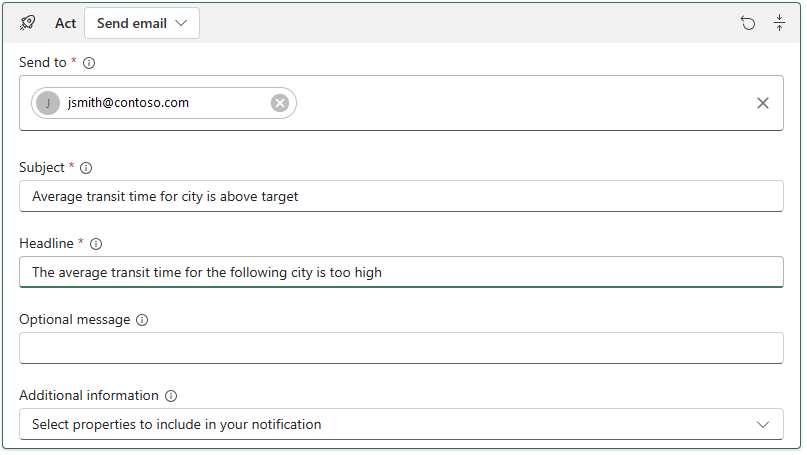

# Overview – what is Data Activator?

Microsoft Fabric and Data Activator are currently in PREVIEW. See the Supplemental Terms of Use for Microsoft Azure Previews for legal terms that apply to Azure features that are in beta, preview, or otherwise not yet released into general availability.
# What is Data Activator?
Data Activator is a no-code tool for automatically taking actions when patterns or conditions are detected in changing data. It monitors data in Power BI reports and Event Hub data streams, for when the data hits certain thresholds or matches other patterns. It then automatically takes appropriate action such as alerting users or kicking off Power Automate workflows.

Data Activator allows customers to build a digital nervous system that acts across all their data, at scale and in a timely manner. Business users can describe business conditions in a no-code experience to launch actions such as Email, Teams notifications, Power Automate flows and call into 3rd party action system. Business users can self-serve their needs and reduce their reliance on internal IT and/or developer teams, either of which is often costly and hinders agility. Customer organizations don’t need a developer team to manage and maintain custom in-house monitoring or alerting solutions.

Some common use cases are:
*	Run ads when same-store sales decline.
*	Alert store managers to move food from failing grocery store freezers before it spoils.
*	Retain customers who had a bad experience by tracking their journey through apps, websites etc.
*	Help logistics companies find lost shipments proactively by starting an investigation workflow when package status isn’t updated for a certain length of time.
*	Alert account teams when customers fall into arrears, with customized time or value limits per customer.
*	Track data pipeline quality, either re-running jobs or alerting when pipelines fail or anomalies are detected.

# FAQ: Things to know before using Data Activator
Data Activator is currently in a preview state where we are actively looking for feedback on, and rapidly making changes to, the product. There may be issues or gaps in the product, and there are some requirements before you can fully use Data Activator:
* You need to be signed up for the Microsoft Fabric preview. Learn more about that [here](https://learn.microsoft.com/fabric/get-started/fabric-trial). 
* You need to have a workspace assigned to a Premium capacity to put the reflex items in. You can sign up for a trial capacity - the link above shows how to do this.
* If you're using Data Activator to alert against data in Power BI reports, make sure you start the trial from the workspace. If you try to create a trigger before the workspace is in a Premium capacity, you'll get a failure message.
* During this private preview, Data Activator is only available in the following Azure regions: Australia Southeast, Canada Central, East US, East US 2, North Central US, North Europe, West Europe, West US. Other regions will be enabled later in CY 2023.

## Enable Data Activator private preview 
NOTE: Read _FAQ: Things to know before using Data Activator_
Before you can use Data Activator, your Power BI Admin needs to enable Data Activator private preview for the tenant. Your Power BI admin can follow these steps to enable private preview.
1. Sign in to Power BI or Fabric using your admin account credentials
2. Click on **Settings** from the page header. Click on **Admin portal** under **Governance and Insights**

3. Select **Tenant settings** from the left navigation pane.
4. Expand **Enable Trident (Private Preview)** under **Microsoft Fabric (Preview)**.

6. Enable the setting. You can choose to have it enabled for your entire organization or a limited set of users using a security group.

## Reflex items in Fabric
A reflex item holds all the information necessary to connect to data, monitor for conditions, and act. You’ll typically create a reflex item for each business process or area you’re monitoring.
To get started, you create a reflex item in your Fabric workspace. From the New menu in the workspace, choose the reflex item.
You’ll connect to a data source and choose the data stream you want to monitor (e.g. an IoT (Internet of Things) device feed, a sensor feed, or an application telemetry stream). You create the business objects that your stream represents, such as a Freezer, Vehicle, Application, or Order. Then, define properties on the objects such as temperature, speed, sales amount. Next, specify the conditions you want Data Activator to look for (e.g. temperature below zero degrees, or speed above 60mph). Finally, you tell Data Activator what action to take as a result such as sending a Teams or email message, or starting a Power Automate workflow.

## Concepts in Data Activator
The following concepts are used to build and trigger automated actions and responses in Data Activator.

### Events
Data Activator considers all data sources to be streams of events. An event is an observation about the state of an object, with some identifier for the object itself, a timestamp, and the values for fields you’re monitoring. Event streams will vary in frequency from many times per second in the case of IoT sensors down to more sporadic streams such as packages being scanned in and out of shipping locations. 
Data being observed from Power BI is also treated as an event stream. In this case, events are observations made of the data on a regular schedule that would typically match the refresh frequency of your Power BI dataset. This might only happen once a day, or even once a week – it’s just a very slowly changing event stream!

### Objects
The business objects that you want to monitor could be physical objects like Freezers, Vehicles, Packages, Users, etc. or less tangible concepts like Advertising Campaigns, Accounts, User Sessions. In your reflex item, you model the object by connecting one or more event streams, choosing a column from the object ID, and specifying the fields you want to make properties of the object.
The term ‘object instance’ means a specific Freezer/Vehicle/Package etc. whereas ‘object’ is typically used for the definition or class of object. We talk about the ‘population’ to refer to all the object instances.

### Triggers
Triggers contain the logic that describes the values you want to monitor over time, the conditions that you want to watch for, and the actions to take as a result. We call these three steps 'Select', 'Detect', and 'Act'.
* Select a value from the events to monitor, and apply any smoothing or filtering to the raw data.
* Detect when the value goes above/below a threshold, or changes to/from a value etc. These conditions may fire the trigger every time, or only if they occur, say, 5 times in an hour.
* Act by sending an alert message, starting a workflow or other action.
 
### Properties
Properties allow modeling of attributes of the objects you care about, for re-use in many triggers. For example, you might select the temperature value from an event, and apply a function to smooth it over five minute windows. That ‘Smoothed temperature’ property could be reused in many other places around your project. You might build one trigger that takes 'Smoothed Temperature’ and sends an email when it goes over 90 degrees Fahrenheit, and one trigger that sends a Teams message if it goes over 110.

## Get started with Data Activator

### Select the Data Activator experience

To access the Data Activator experience in Microsoft Fabric, select it
from the menu at the bottom of the screen. This will tailor your Fabric
experience to Data Activator.


### Create a reflex item

As with all Fabric experiences, you begin using Data Activator by
creating an item in a Fabric Workspace. Data Activator’s items are
called *reflexes.*

A reflex holds all the information necessary to connect to data, monitor
for conditions, and act. You will typically create a reflex for each
business process or area you’re monitoring.

To get started, you create a reflex item in your Fabric workspace. From
the New menu in the workspace, choose the reflex item.

### Navigate between Data Mode & Design Mode

When you open a reflex, you will see two tabs at the bottom of the
screen that switch between *data mode* and *design mode*. In data mode,
you can see your incoming data and assign it to objects. In design mode,
you build triggers from your objects. At first these will be empty; the
next step after creating a reflex is to populate it with your data.


### Next Step: add data to your reflex

Once you have created a reflex, you will need to populate it with your
data. Learn how to get data into your reflex [here.](#get-data)
Alternatively, if you just want to learn about Data Activator using
sample data, you can try the [*step-by-step tutorial using sample
data*](#tutorial-using-sample-data).

## Get data

### Get data from Power BI

You can use Data Activator to trigger notifications when conditions are
met about data in a Power BI report. For example, if you have a report
displaying daily sales per store, you could send a notification at the
end of the day if daily sales for any store fall beneath a threshold.
You can send notifications to yourself, or to others in your
organization. This section explains how notifications can be created and
triggered.

#### Prerequisites

Before you begin, you will need a Power BI report that is published
online to a Fabric workspace in a Premium capacity.

#### Create a Data Activator trigger from a Power BI Visual

##### Select "Trigger Action" on your Power BI visual.

To begin creating a trigger from a Power BI report:

1. Open your Power BI report.
1. Choose a visual on the report for Data Activator to monitor. 
1. Click the ellipsis ("…") at the top-right of the visual, and select
    "Trigger Action."

The following image shows an example of how to trigger an action from a
visual that displays today’s sales for each store in a retail chain:


##### Create your Data Activator trigger.

Next, define your trigger conditions and to create your trigger. In the
"Create Alert" dialog that appears, do the following:

1. Fill out the *"What to monitor"* section. This tells Data Activator which measure to monitor, and how often to check its value. Data Activator will check the value of the measure separately for each value of the "For Each" dimension that you select.
1. Fill out the *"What to detect"* section. This defines your trigger condition. Whenever this condition is met, Data Activator will send a notification.
1. Fill out the *"Where to save"* section. This tells Power BI where to save your Data Activator trigger. You can choose an existing reflex item, or you can create a new reflex item.
1. Choose "Continue." This will create your Data Activator trigger and open it within your reflex item.  

Continuing with the example from step 1, the following image shows how
you would create a trigger that will fire daily if the sales for any
store drop below $60,000:


#### Next step: go to Data Activator to start your trigger

The final step is to go to Data Activator to define the notification
that Data Activator should provide when your trigger fires, then start
your trigger. Power BI will prompt you to start your trigger:  


Pressing "Start your trigger" will take you to Data Activator to start
your trigger. Refer to [*Start and stop your
triggers*](#start-and-stop-your-triggers) for information on how to do this.

### Get Data from EventStreams 

If you have real-time streaming data in Fabric EventStreams, you can
connect it to Data Activator. This section explains how.

#### Prerequisites

Before you begin, you will need an EventStream item in Fabric with an
existing connection to a Source. Each event in the source must consist
of a JSON dictionary, and one of the dictionary keys must represent a
unique object ID. Here is an example of an event that meets these
criteria:

```json
{

"PackageID": "PKG123",
"Temperature": 25
}
```

In this example, "PackageID" is the unique ID key.

#### Connect your EventStream item to Data Activator

To connect your EventStream item to data activator:

1. Open your EventStream item
2. Add a destination to your EventStream item, of type "Reflex":
   

 
3. In the side panel, select an existing reflex item, or make a new one, as appropriate, then click "Add.":
   


4. Open your reflex item. You will see the data flowing from your EventStream item in the data pane. 


#### Next step: go to Data Activator to create objects from your events

Once you have connected your EventStream item to data activator, the
next step is to assign your data to some objects. To do this, follow the
steps described in
[Assign data to objects in Data Mode](#assign-data-to-objects-in-data-mode).

## Assign data to objects in Data Mode

Once you have [*gotten data*](#get-data) into Data Activator, the
next step is to assign your events to objects. You do this in **Data
Mode**, which you can access from the tab at the bottom of the screen. 

**Note:** if you started from Power BI, then Data Activator will
automatically create an object for you and assign your Power BI data to
it. You can skip this section unless you wish to combine your Power BI
data with other events coming from EventStreams.

### Assign data to a new object

To create an object, pick the events that you wish to monitor, then hit
"Assign your data" in the ribbon in the data pane. Data Activator will
prompt you for an Object name and a Key Column. Choose an object name
that reflects the type of object to which your events refer. The Key
Column must be a column in your events that uniquely identifies the
objects being monitored. Optionally, you can use "Assign Properties" to
import additional columns from your event stream and convert them into
properties on your objects. Refer to [Create Properties](#create-properties)
for more information on properties.

The example below is based on the sample "Packages" data that comes with
Data Activator. Since this data is monitoring packages, we choose
"Package" as our object name. We choose "Package ID" as our key column
because it uniquely identifies packages:


When you create an object you will be navigated to Design mode** **with
the event stream for the new object selected. The preview in the
following image shows you the events that were received split out by the
unique values from the ID column.


By default the events for five random instances for the previous 24
hours are displayed in the chart. You can change this using the
population selector and time selectors above the card.

### Assign data to an existing object

You can assign multiple data streams to a single object. This can be
useful if data about an object is spread across multiple streams. A
typical reason for this would be that you have slowly-changing reference
data about an object in one event stream, and fast-moving updates about
an object in another event stream. 

You achieve this using the "Assign to Existing" option in the "Assign
Data" pane. The process is the same as for assigning data to a new
object, except that you select an existing object to assign the events
to. 

**Note:** when assigning to an existing object, it is essential that you
choose a key column that references the same object IDs that you used
when creating the object in the first place, otherwise you will get
unexpected results from your properties and triggers.


### Assign data to multiple objects

You can assign a single event source to multiple objects. This is useful
if you event source references multiple object types. The sample
"Packages" event streams used in the
[*tutorial*](#tutorial-using-sample-data) reference both a Package ID and a
City, so it can be useful to create both a "Package" and a "City" object
from the packages streams. Since there are multiple packages in each
City, this lets you create aggregate measures at the City level, such as
the number of packages currently in transit for a given City.

To assign an event stream to multiple objects, you follow the procedures
described in the previous two sections, for each object to which you
want to assign the event stream.

## Create Triggers in Design Mode

Once you have [assigned your data to objects](#assign-data-to-objects-in-data-mode), you
can create triggers to act on your data. You do this in **Design Mode**,
which you can access from the tab at the bottom of your screen. 

### Define a trigger condition and action

Triggers are where you specify the values you want to select from
events, the conditions you want to detect, and the actions you want Data
Activator to take. 

#### Step 1: Make a new trigger

You use the ‘New trigger’ button in the ribbon to create a new trigger.
You can give it a name by clicking the name of the trigger and editing
it.

#### Step 2: Select your data

The next step is to select the value for the trigger. You can either
choose from a column from an event, or from a property you’ve already
defined. (See [Create Properties](#create-properties) for information
on properties.)

Once you select a column or property, you see a preview of the values
for a sample of the instances of the object.

#### Step 3: Define the condition to detect

Next, you choose the type of condition that you want to detect. You can
use conditions that check when a numeric value goes above/below a
threshold (e.g. Temperature is greater than 30), when a logical
true/false value changes (e.g. HasFault becomes True), or when a string
value changes (e.g. Status changes from InCompliance). See [Detection conditions in triggers and properties](#detection-conditions-in-triggers-and-properties) for
more details.

The Detect card then shows two charts:

The first shows, for the 5 sampled instances, when the condition was
detected. In the screenshot above the instance labeled in yellow,
RFX-9461367, crossed the threshold of 45 degrees 4 times. 

The second chart show the total number of times the trigger would have
fired, for all instances that Data Activator is tracking. There are two
spikes, around 5am and 7am, where the alert was fired 4 times. These
might not be from the 5 instances sampled in the other charts.

#### Step 4: Define the action to take

Finally, the act card lets you choose what to do when the condition is
detected.

Different action types will have different parameters, such as the email
address you want to send to, the workflow you want to start, subject
line or additional information etc.

### Test your trigger

After you have created a trigger, you can test it by clicking "Send me a
test alert". This will find a past event for which the trigger
activation is true, then send you an alert so that you can see what the
alert would have looked like for that event. Note that:

  
- The test alert will always go to you, regardless of the recipient field in the "Act" card
- The "Send me a test alert" option is only enabled if you have had at least one past event for which the trigger condition is true.

### Start and stop your triggers

Triggers are created in a 'Stopped' state. This means they're not being
evaluated as data flows into the system, and won't take any actions as a
result. You also need to select Start from the toolbar for Data
Activator to start running the trigger and taking action. 

Once started, you will see ‘Running’ appears in the title area of the
property.

The toolbar will change to allow you to Stop the trigger. If you make
changes to the trigger (for example changing the condition it looks
for), you need to select Update in the toolbar to make sure that the
running trigger uses the new values.

When you delete a trigger (or Object) it can take up to 5 minutes for
any back-end processing of data to complete. This means your trigger may
continue to monitor data, and take actions accordingly, for a few
minutes after it has been deleted.

### Create Properties

Sometimes, you need to reuse trigger logic across multiple triggers.
This is where properties come in. You can create a property that defines
a reusable condition or measure, then reference that property from
multiple triggers.

To create a property, select "New Property" from the ribbon, then define
your property logic. Here, we define a property called "Maximum Temp
last hour" on a package object:

Once you have defined a property, you can reference it from one more
triggers, via the select card. Here, we reference the property we made
earlier in a "Package too warm" trigger:

## Detection conditions in triggers and properties

This section describes the range of detection conditions available to
you when you create a trigger.

### Summaries over time


Summaries are available in *select* cards in properties and triggers,
via the "Add" button. When you create a summary, you specify a *time
window* which can be between 1 minute and 24 hours long. A summary
takes all of the values of the property/column during each time window
and converts them into a single summary value for the time window.

| Summary type                  | Description                                                                       |
| ------------------------------| --------------------------------------------------------------------------------- |
| **Average over time**         | Computes the average value of the property/column over the time window            |
| **Count**                     | Computes the number of events containing the property/column over the time window |
| **Minimum/Maximum over time** | Computes the minimum/maximum value of the property/column during the time window  |

### Filters


Filters are available in **select** and **detect** cards via the "Add" button. In a filter, you specify a
comparison condition on a property. The filter retains only those events
that meet the comparison condition. All other events are removed from
consideration for the trigger.

You can use filters on any type of property, but typically you will use
filters with text values, so that you can create a condition on a subset
of your data. For example, you might set a filter of "City=’Redmond’" on
some package-tracking events, to set a condition on only events on
packages in Redmond.

You can specify up to 3 filters on a card.

### Conditions

You specify a condition in the **detect** card.

#### Condition types

The condition type specifies what type of condition should cause the
trigger to activate:


Condition types fall into the following categories:

| Condition type | Description |
| --- | --- |
| **"Is"** conditions | "Is" conditions activate for each event for which the condition is true. |
| **"Becomes"** conditions | "Becomes" conditions activate only when the condition becomes true, after having previously been false. For example, "Becomes greater than 10" will activate if the value of the property changes from a value of 5 (less than 10) to a value of 11 (greater than 10). It will only activate again when the condition goes from being false to true. |
| **Enters/Exits Range** conditions | The Enters range condition specifies a range of values, and activates at the point when a property value enters the range. It only activates when the previous value of the property was outside of the range, and the current value is within the range. The exits range condition is similar, except that it activates when the property value goes outside of the range. |
| **Changes, Changes to, Changes from** | These conditions activate when a value of a property changes value. You can use the the "to" and "from" qualifiers to activate the condition when the value changes to or from a specific value. |

#### Condition Timers

After you specify a condition type, you can specify a condition timer:


The condition timer indicates how long, or how many times, the condition
must be true before the trigger fires.

| Timer           | Description                                                                                                     |
| --------------- | --------------------------------------------------------------------------------------------------------------- |
| **Each time**     | Activate the trigger each time the condition is true                                                            |
| **Number of times** | Count how many times the condition is true, and activate the trigger only when it has been true this many times |
| **Stays**           | Activate the trigger if the condition is continuously true for this amount of time                              |

## Use Custom Actions to trigger Power Automate Flows

Using Power Automate, you can generate actions in external systems when
your Data Activator triggers activate. This can be useful for:

1)  Sending notifications via systems other than Teams and Email
2)  Creating action items in ticketing systems
3)  Calling line-of-business apps

To trigger Power Automate flows from your triggers, you first create a
*custom action*. Then, you call your custom action from your triggers. 

### Create a Custom Action

A custom action is a reusable action template that you can use in
multiple triggers, in multiple Reflex items. Creating a custom action
requires familiarity with Power Automate. However, once you have created
a custom action, other Data Activator users can use the action in any
trigger, without requiring any knowledge of Power Automate. 

A custom action defines how to call a specific external system from a
Data Activator trigger using a flow. It defines a set of* input fields*
to pass from your triggers to the flow, so that the flow can call the
external system. For example, suppose you wanted to define a custom
action that sends a SMS message. The input fields for such an action
might be "Phone number" and "Message". This custom action would link to
a flow that uses an SMS connector to send the message to the recipient.

#### Name your action and add input fields

To create a custom action, select "new custom action" from the ribbon in
the design pane. Then, give your action a name (such as "Send SMS
message" and define the input fields (such as "Phone number" and
"Message"). 


The next step is to define your flow in Power Automate. Click the "copy
connection string" button , then click "Create Flow in Power Automate".
This will create a flow in Power Automate, and will take you to it so
that you can define your flow.

#### Define your flow

The flow will be pre-populated with an action for data activator.
**Important:** you must paste the connection string from the previous
step into this action, as shown in the screenshot below. Once you have
done so, add further steps to your flow as needed, and save the flow.


To access your input fields in the flow, use a Power Automate expression
of the form shown below. Use the "Expression" tab in the field editor to
add your expression. Replace `NAME_OF_INPUT_FIELD` with the name of
your input field. 

```
    triggerBody()?['customProperties/NAME_OF_INPUT_FIELD'].
```

#### Complete your custom action

After you save your flow, return to Data Activator. Upon successful
saving of the flow, you will see a confirmation box in Data Activator as
follows. At this point, your custom action is complete, and you may move
on to the next step, [Call your Custom Action from a
Trigger](#call-your-custom-action-from-a-trigger). If you need to rename your action, or edit the
list of input fields, you can still do so at this point. Click "Done"
when you are ready.


### Call your Custom Action from a Trigger

Once you have created a custom action, it will be available for use by
all Data Activator users, in all triggers and reflexes. To call your
custom action, from a trigger, click the "Custom Action" tile in the
trigger’s "Act" card, and select your custom action from the list:


You will then get a card for your custom action, containing the input
fields for your custom action. Fill them out as appropriate for your
trigger definition:


When your trigger activates, it will call your flow, sending it the
values of the input fields that you defined.

## Tutorial using Sample Data

This step-by-step tutorial uses the sample "Packages" data that comes
with reflex. By the end of this tutorial, you will have:

1)  Explored the main features of data activator.
2)  Created an object.
3)  Created and started a trigger.


### Prerequisites

Before you begin, you will need a workspace with a Fabric capacity. You
can learn about Fabric workspaces
[*here*](https://learn.microsoft.com/en-us/fabric/get-started/workspaces).

### Step-by-step guide

#### Step 1: Create a sample reflex

From the Fabric homepage, select a workspace with a Fabric capacity.
Select the Data Activator experience then click "Reflex sample". This
will create a reflex that is pre-populated with sample events and
objects.


#### Step 2: Explore the package events in Data Mode

In this step, we will explore data mode. 

1. In your newly-created reflex, click on the "data" tab, then select the "Package in Transit" events stream. These events show the real-time status of packages that are in the process of being delivered by a logistics company. Look at the incoming events and note the columns on the events. The "PackageId" column uniquely identifies the Packages; this is the ID column that we use to assign the Package events to Package objects.

1. Click on the other two event streams. These come from different sources in the logistics company, but they are also about packages. Note that they also have a "Package ID" columns.

#### Step 3: Explore the Package object in Design Mode

Now we will explore Design Mode. 

1. Select the "Design" tab at the bottom of the screen to enter Design Mode.

1. In the left navigation pane, look at the "Events" section of the Package object. Note that all 3 event streams from Data Mode are linked to the package object. This enables you to create triggers about packages that use data from any of the 3 event streams.

1. Click on the trigger called "Medicine too warm". Observe how it works. The **select** card chooses the "Temperature" column from the "Package in Transit" events. The **detect** card detects when the Temperature becoming greater than 50, but only if the "Special Care" column equals "Medicine". Finally, the **act** card ends an email if the detection condition is true.

1. Look at the other triggers to learn how they work.

#### Step 4: Start the "medicine package too warm" trigger

Now that you have familiarised yourself with the packages events and
objects, you are ready to start a trigger.

1. Click on the "medicine too warm" trigger
1. Review the "Act" step which sends an email. Make sure that the email address on the trigger is your email address. Alter the subject and message fields to your liking.
1. Click "Send me a test alert". You will receive a test email (it might take a minute or two to arrive). Make sure it looks the way you expect.
1. In the ribbon, click "Start". This will cause the trigger to email you whenever a medicine package is too warm. The trigger should fire several times every hour. (You might have to wait 10 minutes or so for it to fire.)
1. Later, you can turn off the trigger using the "Stop" button.

#### Step 4: Create a "City" object

Now it is time to create an object of your own. In this section, you
will create a "City" object that tracks the status of package deliveries
at the level of Cities, rather than individual packages.

1. Return to Data Mode
1. Click on the "Package In Transit" stream
1. Click "Assign your data" in the ribbon
1. Name your new object "City" and choose "City" as the ID column
1. Click continue

#### Step 5: Create a trigger on the City object

Now you will create a trigger that alerts you if the average time in
transit, for any city, exceeds a target.

1. Go to Design Mode and select your new "City" object. Click "New trigger" then name it "Average transit time above target". After this step, your City object will look like this:


2. In your trigger’s "select" card, select "HoursInTransit." Then click "Add" to set an "Average over time" aggregation of 1 hour. After this step, your trigger will look like this:


3. In the "detect" card, detect whether the average transit time for a given City is greater than 5 hours. Set the trigger to alert you once per hour per city. After you complete this step, your Detect card will look like this:
 


4.  Specify an action for your trigger. You can choose Email or Teams. Customize your action according to how you would like it to appear:
  


5. Test your trigger by clicking the "Send me a test alert" button. Make sure you get an alert (it might take a minute or two to arrive.)
   
6. Start your trigger by clicking the "Start" button.

#### Congratulations on completing the tutorial!

Congratulations on creating your first object and trigger. As next
steps, you might want to try setting up some other triggers on either
the "City" or "Package" objects. When you are ready to try using Data
Activator on real data, follow the steps in the [Get data](#get-data) section.

